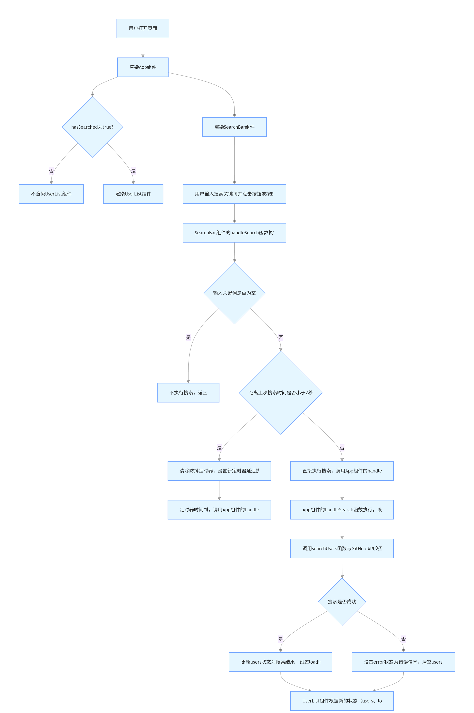

# GitHub_User_Searcher--React-Axios

这是一个使用React、Axios、Vite和GitHub API构建的Github用户搜索网页。
[在线体验地址](git-hub-user-searcher-react-axios-hm7pxh114-zihao17s-projects.vercel.app)

## 功能特点

- 搜索GitHub用户
- 展示用户ID、用户名和头像
- 防抖搜索功能，防止API请求过于频繁
- 使用GitHub个人访问令牌进行认证，提高API请求限制

## 流程图



## 安装与设置

1. 克隆仓库

```bash
git clone https://github.com/zihao17/GitHub_User_Searcher--React-Axios.git
cd GitHub_User_Searcher--React-Axios
```

2. 安装依赖

```bash
pnpm install
```

3. 创建`.env`文件并添加GitHub个人访问令牌

```
VITE_GITHUB_TOKEN=your_github_token_here
```

4. 启动开发服务器

```bash
pnpm dev
```

## 如何获取GitHub个人访问令牌

1. 登录GitHub账号
2. 点击右上角头像，选择"Settings"
3. 在左侧菜单中选择"Developer settings"
4. 选择"Personal access tokens" > "Tokens (classic)"
5. 点击"Generate new token"
6. 为令牌添加描述，选择"public_repo"和"read:user"权限
7. 点击"Generate token"并复制生成的令牌
8. 将令牌添加到`.env`文件中

## 技术栈

- React
- Vite
- Axios
- GitHub API

## 注意事项

- GitHub API有请求频率限制，未认证用户每小时60次，认证用户每小时5000次
- 应用实现了防抖功能，限制搜索频率为最多每2秒一次
- 搜索结果包含用户的基本信息和详细信息
